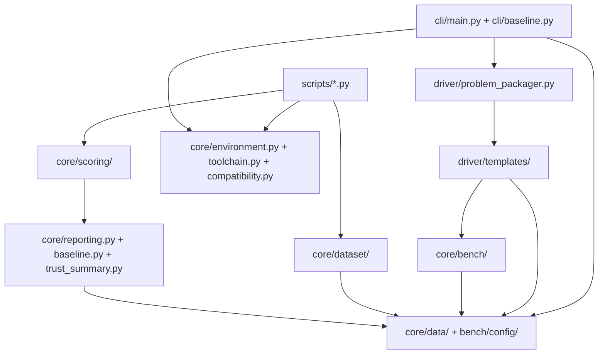

<!-- generated-by: gsd-doc-writer -->
# Architecture

## System Overview

SOL ExecBench ROCm Port is a layered Python CLI package for evaluating GPU
kernel solutions on AMD ROCm hardware. Its primary inputs are benchmark
definitions, workload rows, solution metadata and source files, and optional run
configuration. The evaluator stages those inputs in an isolated temporary
directory, compiles native HIP/C++ solutions when needed, runs a generated
evaluation driver in a subprocess, and emits typed JSONL trace records plus
optional diagnostic sidecars. Supporting modules provide dataset inventory,
ROCm compatibility evidence, scoring, baseline comparison, and release-quality
guardrail reports.

## Component Diagram



## Data Flow

1. The `sol-execbench` entry point in `pyproject.toml` dispatches to
   `sol_execbench.cli:cli`, which is implemented by `SolExecbenchCli` in
   `src/sol_execbench/cli/main.py`.
2. Root evaluator calls resolve either a problem directory or explicit
   `--definition`, `--workload`, `--solution`, and optional `--config` paths.
3. The CLI loads inputs into `Definition`, `Workload`, `Solution`, and
   `BenchmarkConfig` objects before creating a `ProblemPackager`.
4. `ProblemPackager` writes normalized staged files named `definition.json`,
   `workload.jsonl`, `solution.json`, `config.json`, and solution source files into a
   `tempfile.mkdtemp(prefix="sol_execbench_")` staging directory.
5. For native ROCm solution categories, `ProblemPackager.compile()` copies
   `src/sol_execbench/driver/templates/build_ext.py`, injects HIP offload architecture flags when
   they are missing, and returns the command that builds `benchmark_kernel.so`.
6. `ProblemPackager.execute()` copies `src/sol_execbench/driver/templates/eval_driver.py` and
   returns the evaluation command. The CLI runs compile and evaluation commands
   as subprocesses with `PYTORCH_ALLOC_CONF=expandable_segments:True`.
7. The generated evaluation driver imports reference and candidate code,
   performs source and runtime guardrail checks, imports user Python solutions
   with unique staged module identities, generates or loads workload inputs,
   runs correctness and timing helpers, and prints one `Trace` JSON
   object per workload to stdout.
8. The CLI parses trace JSONL back into `Trace` models, writes optional trace,
   profiler, static-evidence, and environment sidecars, prints a Rich summary
   unless `--json` is selected, and exits nonzero when any workload fails.
   If no parseable trace output exists, the CLI persists a bounded
   diagnostic-only no-trace sidecar outside canonical trace JSONL.

The root CLI also dispatches GPU-free metadata subcommands before normal
evaluation: `contract`, `doctor`, and `toolchain`. The separate
`sol-execbench-baseline` entry point dispatches to `src/sol_execbench/cli/baseline.py`
for trace baseline comparison.

## Key Abstractions

| Abstraction | Location | Role |
| --- | --- | --- |
| `SolExecbenchCli` | `src/sol_execbench/cli/main.py` | Click command wrapper that routes evaluator calls and metadata subcommands. |
| `ProblemPackager` | `src/sol_execbench/driver/problem_packager.py` | Stages normalized problem files, solution sources, generated driver files, and native build commands. |
| `Definition` | `src/sol_execbench/core/data/definition.py` | Describes benchmark inputs, outputs, symbolic axes, and reference implementation source. |
| `Workload` | `src/sol_execbench/core/data/workload.py` | Represents one workload row, including generated, scalar, custom, or safetensors inputs and tolerances. |
| `Solution` and `BuildSpec` | `src/sol_execbench/core/data/solution.py` | Validate solution metadata, source files, entry points, ROCm language categories, hardware targets, and compile options. |
| `BenchmarkConfig` | `src/sol_execbench/core/bench/config/benchmark_config.py` | Holds warmup, iteration, clock-lock, reference-timing, and seed settings for evaluation. |
| `Trace` | `src/sol_execbench/core/data/trace.py` | Typed per-workload output containing correctness, performance, environment, and status data. |
| `EnvironmentSnapshot` and `EnvironmentDiagnostics` | `src/sol_execbench/core/environment.py` | Capture optional ROCm, PyTorch, GPU, visible-device, and tool evidence. |
| `ToolchainRoutingReport` | `src/sol_execbench/core/toolchain.py` | Describes ROCm evidence-tool selection for requested evidence levels and artifact types. |
| `RocmCompatibilityMatrixReport` | `src/sol_execbench/core/compatibility.py` | Models compatibility matrix entries, evidence, validation scope, and execution decisions. |
| `DockerTargetManifest` | `src/sol_execbench/core/docker_matrix.py` | Models ROCm Docker targets and preflight evidence used by Docker tooling and tests. |
| `TraceRunSummary` and `BaselineComparison` | `src/sol_execbench/core/reporting.py`, `src/sol_execbench/core/baseline.py` | Summarize trace runs and compare new traces against baseline traces. |
| `DatasetReuseDecision` | `src/sol_execbench/core/dataset/run_closure.py` | Decides whether existing dataset traces can be reused based on rerun flags, failure counts, and execution-closure provenance. |
| `DatasetShardPlan` and `DatasetShardMergeResult` | `src/sol_execbench/core/dataset/sharding.py` | Define deterministic workload shard assignment, per-shard trace refs, ordered trace merging, duplicate detection, and incomplete-shard reporting. |

## Directory Structure Rationale

```text
src/sol_execbench/
  cli/       User-facing Click commands for evaluation, metadata, and baseline comparison.
  core/      Shared data models, benchmark helpers, dataset tooling, evidence models, scoring, and reports.
  data/      Packaged AMD hardware model JSON consumed by scoring helpers.
  driver/    Staging orchestration and generated compile/evaluation templates.
```

The package keeps the command-line surface in `cli/`, reusable business logic
and typed contracts in `core/`, packaged static data in `data/`, and generated
subprocess execution assets in `driver/`. This separation keeps user solution
execution outside the CLI process while allowing the CLI, scripts, and tests to
reuse the same Pydantic models and evidence/reporting helpers.

Top-level operational directories follow the same boundary:

| Path | Role |
| --- | --- |
| `tests/` | Pytest coverage for schemas, drivers, examples, ROCm migration behavior, evidence reports, Docker checks, and guardrails. |
| `examples/` | Runnable PyTorch, Triton ROCm, and native ROCm example problems. |
| `docs/` | User-facing docs, schema references, ROCm validation notes, and research/release evidence. |
| `scripts/` | Dataset download, inventory, matrix, parity, scoring, trust, and batch execution helpers. |
| `docker/` | ROCm Dockerfile, entrypoint, wrapper script integration, and target manifest. |
| `data/` | Local downloaded benchmark assets and runtime data outside the package. |

## Subprocess Boundary

Evaluation code does not run inside the CLI process. The staging directory is
created with `tempfile.mkdtemp(prefix="sol_execbench_")`; generated files and
solution sources are copied there before subprocess execution. The packager
removes the staging directory when it is garbage-collected unless
`--keep-staging` is set.

This boundary keeps solution code, generated driver code, native compilation
artifacts, optional profiler output, static evidence artifacts, and imported
reference code separate from the CLI process and repository checkout.

The subprocess boundary and static source review are execution guardrails, not
hard sandboxing. They should not be treated as multi-tenant isolation for
adversarial submissions; untrusted code still needs an external isolation layer
such as a container, VM, or dedicated ROCm host.

## ROCm Solution Boundary

The accepted solution language categories are:

- `pytorch`
- `triton`
- `hip_cpp`
- `hipblas`
- `miopen`
- `ck`
- `rocwmma`

Native categories share the HIP/C++ staging and build path. `Solution` and
`BuildSpec` reject legacy CUDA/NVIDIA language values and CUDA compile option
keys with ROCm migration guidance. Native entry points must use `.hip`, `.cpp`,
`.cc`, `.cxx`, `.c`, `.h`, or `.hpp`; Python and Triton entry points must use
`.py`. Python and native categories cannot be mixed in one solution.

Native compile options are intentionally constrained. Response files,
host include/library path injection, runtime loader options, and unsafe linker
path behavior are rejected during solution validation before native extension
loading. Documented ROCm/HIP extension flags remain accepted.

For native builds, `ProblemPackager` injects HIP offload architecture flags when
no explicit architecture flag is present. It uses concrete `gfx*` hardware
targets from solution metadata or probes local ROCm tooling when the target is
`LOCAL`.

## Timing And Evidence

The primary timing path uses HIP-backed PyTorch device events through the
historical `torch.cuda` namespace. Optional diagnostic evidence paths are kept
separate from benchmark correctness:

- `--profile rocprofv3` attempts to run evaluation under `rocprofv3`; on
  profiler failure, the CLI falls back to normal evaluation and writes profile
  metadata when available.
- `--static-evidence auto` collects diagnostic static kernel sidecars for
  native builds and reports unsupported status for non-native solutions.
- `SOLEXECBENCH_ENV_SNAPSHOT` or `SOLEXECBENCH_ENV_SNAPSHOT_PATH` can request an
  environment snapshot sidecar.

These sidecars do not change trace schema or correctness status.

## Dataset, Scoring, And Reporting

`src/sol_execbench/core/dataset/` supports dataset layout discovery, inventory,
readiness, manifest, checksum, execution-closure, paper-denominator,
ready-subset, category, parity-gap, reuse-policy, and deterministic sharding
workflows. Scripts such as
`scripts/download_solexecbench.py`, `scripts/inspect_dataset.py`,
`scripts/report_paper_denominator.py`, `scripts/report_parity_gaps.py`, and
`scripts/run_dataset.py` use those helpers.

Dataset reuse and closure behavior is package-owned. `run_closure.py` computes
reuse decisions, stale-provenance mismatches, selected-workload closure
records, derived evidence refs, and missing-evidence states. `sharding.py`
provides an importable design path for future parallel dataset execution while
leaving the default `scripts/run_dataset.py` CLI behavior serial and
compatible.

`src/sol_execbench/core/scoring/` contains AMD hardware models, bound estimates,
bound graphs, SOL derivation helpers, baseline artifacts, and AMD-native score
models. These helpers consume traces and evidence sidecars to produce guarded
AMD-native reporting artifacts.

Release-quality reporting modules such as `src/sol_execbench/core/claim_upgrade.py`,
`src/sol_execbench/core/consistency.py`,
`src/sol_execbench/core/evaluation_stability.py`,
`src/sol_execbench/core/matrix_diff.py`,
`src/sol_execbench/core/runtime_evidence.py`,
`src/sol_execbench/core/scoring_guardrails.py`, and
`src/sol_execbench/core/trust_summary.py` build higher-level evidence and
claim-boundary reports from the lower-level dataset, matrix, trace, and scoring
records.

## Diagnostics And Toolchain Routing

The `contract`, `doctor`, and `toolchain` subcommands are dispatched by
`SolExecbenchCli` before normal evaluation:

- `sol-execbench contract --json` prints GPU-free evaluator compatibility
  metadata from `build_evaluator_contract()`.
- `sol-execbench doctor --json` prints ROCm environment diagnostics from
  `build_environment_diagnostics()`.
- `sol-execbench toolchain --json` prints a routing decision for a requested
  evidence level and artifact type.
- `sol-execbench toolchain --json --list-registry` prints the default ROCm
  toolchain registry.

Docker-related diagnostics live in `src/sol_execbench/core/docker_matrix.py` and
`src/sol_execbench/core/dependency_matrix.py`. They are used by Docker scripts
and tests to describe target selection, dependency policy, observed PyTorch ROCm
versions, and preflight status without coupling those checks to the evaluator
subprocess.
