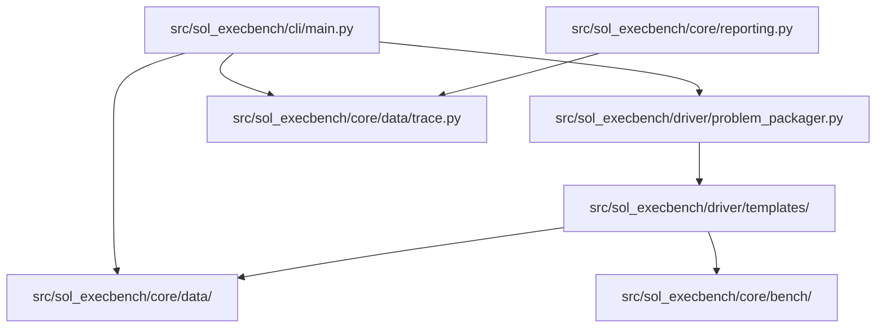

<!-- generated-by: gsd-doc-writer -->
# Architecture

SOL ExecBench ROCm Port is a Python package and CLI for evaluating GPU kernel
solutions on AMD ROCm hardware. It reads benchmark definitions, workload rows,
solution metadata, and optional benchmark configuration, stages the solution in
an isolated temporary directory, compiles HIP/C++ implementations when needed,
runs the generated evaluation driver, and emits typed trace records.

## System Overview

The project is organized as a layered Python package under
`src/sol_execbench/`. The CLI layer handles user input and reporting, the core
layer defines public data models and benchmark utilities, and the driver layer
packages a problem into files and commands that run in a subprocess. The runtime
boundary is deliberately process-based: solution code is copied into a staging
directory and executed by generated driver scripts rather than imported directly
into the CLI process.

## Component Diagram



## Data Flow

1. `src/sol_execbench/cli/main.py` resolves either a problem directory or
   explicit `definition.json`, `workload.jsonl`, `solution.json`, and optional
   `config.json` paths.
2. The CLI loads those files into Pydantic and dataclass objects:
   `Definition`, `Workload`, `Solution`, `Trace`, and `BenchmarkConfig`.
3. `ProblemPackager` writes normalized problem files and solution sources into
   a temporary staging directory.
4. HIP/C++ solutions are compiled by writing `build_ext.py` from
   `src/sol_execbench/driver/templates/build_ext.py` and running
   `python build_ext.py` in the staging directory.
5. All solutions run through `eval_driver.py` from
   `src/sol_execbench/driver/templates/eval_driver.py`, which executes the
   reference and candidate implementations, checks correctness, measures
   latency, and prints trace JSONL.
6. The CLI parses JSON lines into `Trace` objects, writes optional output, and
   exits successfully only when every workload passes.

## Key Abstractions

| Abstraction | Location | Purpose |
| --- | --- | --- |
| `Definition` | `src/sol_execbench/core/data/definition.py` | Describes the benchmark problem and expected reference function. |
| `Workload` | `src/sol_execbench/core/data/workload.py` | Represents one concrete workload input row and tolerance settings. |
| `Solution` | `src/sol_execbench/core/data/solution.py` | Validates solution metadata, source files, language categories, hardware targets, and build specification. |
| `SupportedLanguages` | `src/sol_execbench/core/data/solution.py` | Defines ROCm-supported solution language categories such as `pytorch`, `triton`, and `hip_cpp`. |
| `BenchmarkConfig` | `src/sol_execbench/core/bench/config/benchmark_config.py` | Stores execution knobs such as warmup runs, measured iterations, clock locking, reference benchmarking, and seed. |
| `ProblemPackager` | `src/sol_execbench/driver/problem_packager.py` | Creates the staging directory contents and returns subprocess commands for compile and execute phases. |
| `time_runnable` | `src/sol_execbench/core/bench/timing.py` | Measures GPU runtime with PyTorch HIP-backed device events. |
| `Trace` | `src/sol_execbench/core/data/trace.py` | Captures per-workload evaluation output and ROCm environment details. |

## Directory Structure Rationale

```text
src/sol_execbench/
  cli/       Click entry points for benchmark and baseline commands.
  core/      Data models, scoring, diagnostics, correctness, timing, and reporting.
  driver/    Staging logic and generated subprocess templates.
```

Top-level directories separate package code from operational assets:

| Path | Role |
| --- | --- |
| `tests/` | Pytest coverage for schemas, driver behavior, examples, ROCm migration checks, and documentation guardrails. |
| `examples/` | Runnable problem examples for PyTorch, Triton ROCm, HIP/C++, and compatibility categories. |
| `docs/` | User-facing ROCm port documentation and validation notes. |
| `scripts/` | Dataset download and batch-run helper scripts. |
| `docker/` | ROCm container definition and entrypoint for GPU evaluation. |
| `data/` | Local benchmark assets downloaded by helper scripts. |

## Execution Isolation

Evaluation uses a temporary staging directory created by the CLI. The packager
copies normalized JSON inputs, solution source files, and driver templates into
that directory before running subprocesses. HIP/C++ compilation is isolated to
the staging directory and produces `benchmark_kernel.so`; Python and Triton
solutions are evaluated by the generated `eval_driver.py` process.

## ROCm-Specific Boundaries

This port keeps PyTorch's historical `torch.cuda` namespace where PyTorch ROCm
exposes HIP-backed device APIs. The timing path in
`src/sol_execbench/core/bench/timing.py` uses `torch.cuda.Event` and
`torch.cuda.synchronize()` for ROCm-compatible event timing, while legacy CUPTI
entry points are compatibility wrappers that route to the event timing path.

