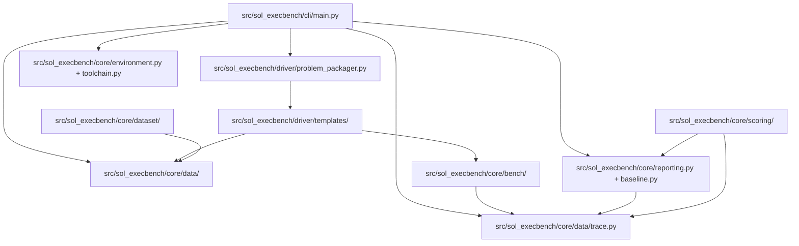

<!-- generated-by: gsd-doc-writer -->
# Architecture

SOL ExecBench ROCm Port is a Python package and CLI for evaluating GPU kernel
solutions on AMD ROCm hardware. It reads benchmark definitions, workload rows,
solution metadata, and optional benchmark configuration, stages the solution in
an isolated temporary directory, compiles native HIP/C++ implementations when
needed, runs the generated evaluation driver, and emits typed trace records.
Separate dataset, diagnostics, toolchain-routing, reporting, and scoring helpers
inspect downloaded benchmark assets, derive ROCm readiness sidecars, compare
trace baselines, collect optional evidence sidecars, and build guarded
AMD-native scoring artifacts.

## System Overview

The project is organized as a layered Python package under
`src/sol_execbench/`. The CLI layer handles user input, trace output,
GPU-free contract metadata, ROCm diagnostics, toolchain routing, and baseline
comparison commands exposed by the `sol-execbench` and
`sol-execbench-baseline` console scripts. The core layer defines public data
models, benchmark utilities, dataset inventory/readiness helpers, ROCm
diagnostics, toolchain routing, reporting, and AMD-native scoring helpers. The
driver layer packages a problem into files and commands that run in a
subprocess. The runtime boundary is deliberately process-based: solution code
is copied into a staging directory and executed by generated driver scripts
rather than imported directly into the CLI process.

## Component Diagram



## Data Flow

1. `src/sol_execbench/cli/main.py` dispatches `contract`, `doctor`, and
   `toolchain` subcommands directly to GPU-free metadata helpers. For normal
   evaluation, it resolves either a problem directory or explicit benchmark
   definition, workload, solution, and optional config paths.
2. The CLI loads those input files into `Definition`, `Workload`, `Solution`,
   and `BenchmarkConfig` objects. `Trace` objects are constructed later from
   evaluation subprocess JSONL output.
3. `ProblemPackager` writes normalized problem files, benchmark configuration,
   and solution sources into a temporary staging directory.
4. For native ROCm language categories, `ProblemPackager.compile()` writes the
   build template from `src/sol_execbench/driver/templates/build_ext.py`; the
   CLI then runs it in the staging directory. The build template uses
   `torch.utils.cpp_extension.load()` with HIP compiler flags and produces
   `benchmark_kernel.so`.
5. Native builds can optionally produce diagnostic-only static kernel evidence
   sidecars through `src/sol_execbench/core/bench/static_kernel_evidence.py`.
   These sidecars are not correctness, performance, timing, scoring, paper
   parity, or leaderboard authority.
6. All solutions run through the generated evaluation driver based on
   `src/sol_execbench/driver/templates/eval_driver.py`. The generated driver
   imports the reference and candidate implementation, blocks dynamic
   `torch.utils.cpp_extension.load()` calls in Python solution code, checks
   reward-hack guardrails, runs correctness checks, measures latency, and prints
   trace JSONL.
7. The CLI parses JSON lines into `Trace` objects, writes optional output, can
   write optional environment, rocprofv3 profile, and static-evidence sidecars,
   and exits successfully only when every workload passes.
8. Optional post-processing paths consume trace JSONL through
   `src/sol_execbench/core/baseline.py`, `src/sol_execbench/core/reporting.py`,
   and `src/sol_execbench/core/scoring/` to compare baselines and derive guarded
   AMD-native score reports.
9. Dataset helper scripts such as `scripts/inspect_dataset.py` and
   `scripts/report_parity_gaps.py` use `src/sol_execbench/core/dataset/` to
   inspect benchmark layouts, produce inventory/readiness/ready-subset
   sidecars, and render parity-gap reports from manifest, execution closure,
   and AMD score evidence.

## Key Abstractions

| Abstraction | Location | Purpose |
| --- | --- | --- |
| `Definition` | `src/sol_execbench/core/data/definition.py` | Describes the benchmark problem and expected reference function. |
| `Workload` | `src/sol_execbench/core/data/workload.py` | Represents one concrete workload input row and tolerance settings. |
| `Solution` | `src/sol_execbench/core/data/solution.py` | Validates solution metadata, source files, language categories, hardware targets, and build specification. |
| `SupportedLanguages` | `src/sol_execbench/core/data/solution.py` | Defines ROCm-supported solution language categories such as `pytorch`, `triton`, and `hip_cpp`. |
| `BenchmarkConfig` | `src/sol_execbench/core/bench/config/benchmark_config.py` | Stores execution knobs such as warmup runs, measured iterations, clock locking, reference benchmarking, and seed. |
| `ProblemPackager` | `src/sol_execbench/driver/problem_packager.py` | Creates the staging directory contents and returns subprocess commands for compile and execute phases. |
| `time_runnable` | `src/sol_execbench/core/bench/timing.py` | Measures GPU runtime with PyTorch HIP-backed device events. |
| `Trace` | `src/sol_execbench/core/data/trace.py` | Captures per-workload evaluation output and ROCm environment details. |
| `EnvironmentSnapshot` | `src/sol_execbench/core/environment.py` | Captures optional ROCm runtime, visible-device, tool-probe, and PyTorch ROCm evidence. |
| `EnvironmentDiagnostics` | `src/sol_execbench/core/environment.py` | Packages `sol-execbench doctor --json` preflight checks and snapshot evidence. |
| `ToolchainRoutingReport` | `src/sol_execbench/core/toolchain.py` | Describes the selected ROCm evidence tool for a requested artifact, evidence level, and hardware target. |
| `Rocprofv3TimingEvidence` | `src/sol_execbench/core/bench/rocm_profiler.py` | Represents optional rocprofv3 timing evidence used for profiling validation paths. |
| `StaticKernelEvidenceSidecar` | `src/sol_execbench/core/bench/static_kernel_evidence.py` | Stores diagnostic-only static kernel artifact metadata, extractor results, and conservative kernel classifications. |
| `DatasetInventory` | `src/sol_execbench/core/dataset/inventory.py` | Captures discovered benchmark categories, problem metadata, workloads, solution files, and dataset denominators. |
| `DatasetReadiness` | `src/sol_execbench/core/dataset/readiness.py` | Classifies whether inventory records are ready for ROCm execution and records blocker reasons. |
| `AmdSolBoundV2Artifact` | `src/sol_execbench/core/scoring/amd_sol_v2.py` | Stores derived AMD SOL bound sidecar data built from bound graphs, operator estimates, and packaged hardware models. |
| `AmdNativeScore` | `src/sol_execbench/core/scoring/amd_score.py` | Stores guarded AMD-native scoring evidence derived from traces, baselines, and SOL-bound artifacts. |

## Directory Structure Rationale

```text
src/sol_execbench/
  cli/       Click entry points for benchmark evaluation and baseline comparison.
  core/      Data models, dataset helpers, scoring, diagnostics, toolchain routing, correctness, timing, and reporting.
  data/      Packaged AMD hardware model JSON used by scoring helpers.
  driver/    Staging logic and generated subprocess templates.
```

Top-level directories separate package code from operational assets:

| Path | Role |
| --- | --- |
| `tests/` | Pytest coverage for schemas, driver behavior, examples, ROCm migration checks, and documentation guardrails. |
| `examples/` | Runnable problem examples for PyTorch, Triton ROCm, HIP/C++, and compatibility categories. |
| `docs/` | User-facing ROCm port documentation and validation notes. |
| `scripts/` | Dataset download and batch-run helper scripts. |
| `docker/` | ROCm container definition and entrypoint for GPU evaluation. |
| `data/` | Local benchmark assets downloaded by helper scripts. |

## Execution Isolation

Evaluation uses a temporary staging directory created by the CLI with
`tempfile.mkdtemp(prefix="sol_execbench_")`. The packager copies normalized JSON
inputs, benchmark configuration, solution source files, and driver templates
into that directory before running subprocesses. HIP/C++ compilation is isolated
to the staging directory and produces `benchmark_kernel.so`; Python and Triton
solutions are evaluated by the generated evaluation-driver process. Normal
evaluation subprocesses receive `PYTORCH_ALLOC_CONF=expandable_segments:True`.
When requested, environment snapshots, rocprofv3 metadata, and static evidence
are written as sidecar files without changing the trace JSONL schema. The
staging directory is removed when the packager is garbage-collected unless the
CLI runs with `--keep-staging`.

## ROCm-Specific Boundaries

This port keeps PyTorch's historical `torch.cuda` namespace where PyTorch ROCm
exposes HIP-backed device APIs. The timing path in
`src/sol_execbench/core/bench/timing.py` uses `torch.cuda.Event` and
`torch.cuda.synchronize()` for ROCm-compatible event timing, while legacy CUPTI
entry points are compatibility wrappers that route to the event timing path.

Native ROCm solution categories are modeled in
`src/sol_execbench/core/data/solution.py` as `hip_cpp`, `hipblas`, `miopen`,
`ck`, and `rocwmma`. The packager can auto-inject HIP offload architecture flags
from explicit `gfx*` targets or from local ROCm tooling when the solution targets
`LOCAL`. Optional profiling helpers in
`src/sol_execbench/core/bench/rocm_profiler.py` collect and parse rocprofv3 CSV
evidence, but the primary benchmark latency path remains PyTorch device-event
timing.

ROCm diagnostics and routing are intentionally separate from canonical trace
records. `sol-execbench doctor --json` builds an `EnvironmentDiagnostics`
payload from timeout-bounded probes such as `amd-smi`, `rocminfo`, and
`rocm_agent_enumerator`, plus PyTorch ROCm smoke checks. `sol-execbench
toolchain --json` uses the default toolchain registry in
`src/sol_execbench/core/toolchain.py` to report which ROCm tool should supply a
requested evidence level for a requested artifact type and hardware target.
