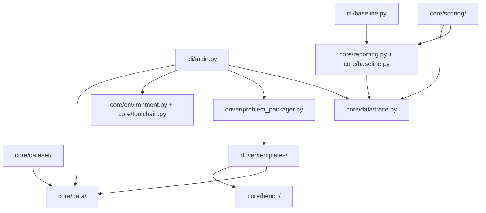

<!-- generated-by: gsd-doc-writer -->
# Architecture

SOL ExecBench ROCm Port is a Python package and CLI for evaluating GPU kernel
solutions on AMD ROCm hardware. It reads benchmark definitions, workload rows,
solution metadata, and optional benchmark configuration, stages a problem in an
isolated temporary directory, compiles native HIP/C++ solutions when needed,
runs a generated evaluation driver, and emits typed trace records.

## Layers

```text
src/sol_execbench/
  cli/       Click entry points for evaluation, diagnostics, metadata, and baseline comparison.
  core/      Data models, benchmark utilities, dataset helpers, scoring, diagnostics, and reporting.
  data/      Packaged AMD hardware model JSON used by scoring helpers.
  driver/    Problem staging and generated compile/evaluation templates.
```

Top-level operational directories:

| Path | Role |
| --- | --- |
| `tests/` | Pytest coverage for schemas, drivers, examples, ROCm migration behavior, documentation guardrails, and Docker dependency checks. |
| `examples/` | Runnable PyTorch, Triton ROCm, and native ROCm example problems. |
| `docs/` | User-facing docs, schema references, ROCm validation notes, and research notes. |
| `scripts/` | Dataset download, inventory, parity, and batch execution helpers. |
| `docker/` | ROCm Dockerfile, entrypoint, wrapper integration, and target manifest. |
| `data/` | Local downloaded benchmark assets. |

## Component Map



## Evaluation Flow

1. `src/sol_execbench/cli/main.py` resolves either a problem directory or
   explicit `--definition`, `--workload`, `--solution`, and optional `--config`
   paths.
2. The CLI loads inputs into `Definition`, `Workload`, `Solution`, and
   `BenchmarkConfig` objects.
3. `ProblemPackager` writes normalized `definition.json`, `workload.jsonl`,
   `solution.json`, `config.json`, and solution source files into a temporary
   staging directory.
4. For native ROCm solution categories, `ProblemPackager.compile()` writes
   `driver/templates/build_ext.py` into the staging directory and returns the
   command that builds `benchmark_kernel.so`.
5. `ProblemPackager.execute()` writes `driver/templates/eval_driver.py` and
   returns the evaluation command.
6. The CLI runs compilation and evaluation in subprocesses with
   `PYTORCH_ALLOC_CONF=expandable_segments:True`.
7. The evaluation driver imports reference and candidate code, applies guardrail
   checks, runs correctness and timing, and prints trace JSONL to stdout.
8. The CLI parses JSON lines into `Trace` models, writes optional trace output
   and sidecars, prints a Rich summary table unless `--json` is selected, and
   exits nonzero when any workload fails.

## Subprocess Boundary

Evaluation code does not run inside the CLI process. The staging directory is
created with `tempfile.mkdtemp(prefix="sol_execbench_")`; generated files and
solution sources are copied there before subprocess execution. The packager
removes the staging directory when it is garbage-collected unless
`--keep-staging` is set.

This boundary keeps solution code, generated driver code, native compilation
artifacts, optional profiler output, and static evidence artifacts separate from
the CLI process and repository checkout.

## Data Models

| Model | Location | Purpose |
| --- | --- | --- |
| `Definition` | `core/data/definition.py` | Benchmark problem and reference function metadata. |
| `Workload` | `core/data/workload.py` | One workload input row and tolerance settings. |
| `Solution` | `core/data/solution.py` | Solution metadata, source files, language categories, hardware targets, and build spec. |
| `BenchmarkConfig` | `core/bench/config/benchmark_config.py` | Warmups, iterations, clock locking, reference timing, and seed. |
| `Trace` | `core/data/trace.py` | Per-workload evaluation result and environment details. |
| `EnvironmentSnapshot` | `core/environment.py` | Optional ROCm, PyTorch, tool, and visible-device evidence. |
| `ToolchainRoutingReport` | `core/toolchain.py` | ROCm evidence-tool routing for artifact type, evidence level, and target hardware. |
| `StaticKernelEvidenceSidecar` | `core/bench/static_kernel_evidence.py` | Diagnostic static kernel artifact metadata and conservative classifications. |

## ROCm Solution Boundary

The accepted solution language categories are:

- `pytorch`
- `triton`
- `hip_cpp`
- `hipblas`
- `miopen`
- `ck`
- `rocwmma`

Native categories share the HIP/C++ staging and build path. `Solution` rejects
legacy CUDA/NVIDIA language values with migration guidance. Native entry points
must use `.hip`, `.cpp`, `.cc`, `.cxx`, `.c`, `.h`, or `.hpp`; Python and Triton
entry points must use `.py`.

For native builds, `ProblemPackager` injects HIP offload architecture flags when
no explicit architecture flag is present. It uses concrete `gfx*` hardware
targets from solution metadata, or probes local ROCm tooling for `LOCAL`.

## Timing And Evidence

The primary timing path uses PyTorch ROCm device events through the historical
`torch.cuda` namespace. Optional profiler and evidence paths are diagnostic:

- `--profile rocprofv3` attempts to run evaluation under `rocprofv3`; on
  profiler failure, the CLI falls back to normal evaluation and writes profile
  metadata when available.
- `--static-evidence auto` collects diagnostic static kernel sidecars for
  native builds and reports unsupported status for non-native solutions.
- `SOLEXECBENCH_ENV_SNAPSHOT` or `SOLEXECBENCH_ENV_SNAPSHOT_PATH` can request an
  environment snapshot sidecar.

These sidecars do not change trace schema or correctness status.

## Dataset And Scoring Helpers

`src/sol_execbench/core/dataset/` supports dataset layout discovery, inventory,
readiness, manifest, checksum, category, ready-subset, and parity-gap workflows.
Scripts such as `scripts/download_solexecbench.py`, `scripts/inspect_dataset.py`,
`scripts/report_parity_gaps.py`, and `scripts/run_dataset.py` use those helpers.

`src/sol_execbench/core/scoring/` contains AMD hardware models, bound estimates,
bound graphs, SOL derivation helpers, baseline artifacts, and AMD-native score
models. These helpers consume traces and evidence sidecars to produce guarded
AMD-native reporting artifacts.

## Diagnostics And Toolchain Routing

The `contract`, `doctor`, and `toolchain` subcommands are dispatched by
`SolExecbenchCli` before normal evaluation:

- `sol-execbench contract --json` prints GPU-free evaluator compatibility
  metadata.
- `sol-execbench doctor --json` prints ROCm environment diagnostics.
- `sol-execbench toolchain --json` prints a routing decision for a requested
  evidence level and artifact type.
- `sol-execbench toolchain --json --list-registry` prints the default ROCm
  toolchain registry.
