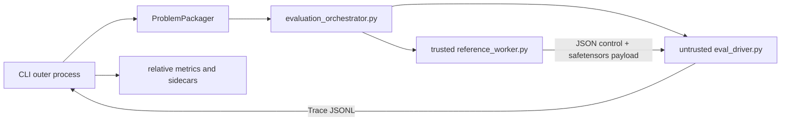

# Architecture v3

SOL ExecBench ROCm Port has two product boundaries:

- `sol_execbench` owns benchmark schemas, trusted input/reference preparation,
  untrusted candidate execution, traces, corpus policy and scoring authority.
- `solar` owns reference graph extraction, strict executable-einsum conversion,
  conversion verification and formal lower-bound analysis.

SOLAR does not receive candidate source, candidate latency, baseline latency,
corpus-selection policy or scores. The only production adapter allowed to import
both packages is `sol_execbench.core.solar_bridge`.

## Evaluation process boundary



`ProblemPackager` stages normalized definition, workload, configuration,
solution metadata and generated templates. `execute()` starts
`evaluation_orchestrator.py`, not the candidate driver directly.

The orchestrator creates two anonymous inherited pipes and a random per-run
token. It starts the trusted reference worker first, waits for readiness, then
replaces itself with the candidate driver so profiler process targeting remains
stable. IPC uses Python's `multiprocessing.connection.Connection` byte-message
framing. Control messages are JSON; tensors are safetensors bytes. The channel
never deserializes pickle.

The candidate-visible definition contains only a signature-compatible reference
stub. The worker loads the full definition first; the orchestrator then removes
that staged file before candidate `exec`. Reference module loading uses an
automatically cleaned temporary directory, so `_reference.py` is never left in
the shared staging tree.

The trusted worker owns:

- loading reference source and custom-input entry points;
- generated and safetensors-backed input preparation;
- reference output production and stabilization;
- optional reference latency measurement;
- structured input-generation versus reference-execution failure categories.

The candidate driver owns:

- static candidate-source review and runtime integrity snapshots;
- loading candidate code only after the reference channel is ready;
- candidate correctness calls against transferred expected outputs;
- candidate timing and timed-output validation;
- reward-hack checks and canonical per-workload Trace emission.

Static review is a deterministic AST-rule gate. It does not implement or claim
equivalence to the paper's LLM-based anti-hacking judge.

The candidate process never imports or invokes the reference implementation.
It receives fresh inputs, expected outputs and reference timing evidence through
the private channel. It emits `speedup_factor=0`; the outer CLI computes
reference-relative speedup only after isolated execution returns.

This is a trust-domain separation inside one host, not a multi-tenant sandbox.
Adversarial submissions still require a container, VM or dedicated worker with
an appropriate device and filesystem policy.

## SOLAR stage boundary

`solar.api.analyze()` is an atomic, fail-closed pipeline:

| Stage code | Owner | Input | Canonical output |
| --- | --- | --- | --- |
| `architecture` | `solar.rocm` | pinned architecture profile | verified architecture identity |
| `graph_extraction` | `solar.graph.extraction` | reference callable and trace inputs | `operator_graph.yaml` |
| `einsum_conversion` | `solar.einsum.conversion` | typed operator artifact | `einsum_graph.yaml` |
| `conversion_verification` | `solar.verification` | reference and executable graph | `conversion-attestation.yaml` |
| `formal_analysis` | `solar.analysis` | verified graph and architecture | `solar-analysis.yaml` |

Each failure reports its exact stage and a stable reason code. A failed run
deletes its staging directory and publishes no partial result directory. A
successful run writes a content-addressed manifest and atomically renames the
complete staging directory into place.

The converter implementation remains large, but its public flow is
split into load, semantic conversion and artifact publication. The analyzer
accepts a typed internal job. Existing SOLAR readability debt is inventoried in
`scripts/solar_readability_debt.json`; it may shrink but cannot gain new items
or larger functions/modules.

## Scoring boundary

`sol_execbench.core.scoring` has three focused responsibilities:

- `formula.py`: strict workload formula and audit preconditions;
- `aggregation.py`: workload-within-problem then equal-problem aggregation;
- `official_authority.py`: release-evidence authority gate.

There are no legacy scoring import facades. The workload formula is:

```text
S(T_k) = 1 / (1 + (T_k - T_SOL) / (T_b - T_SOL))
```

Incorrect candidates receive zero. Correct candidates require finite positive
runtimes, `T_b > T_SOL` and `T_k >= T_SOL`; violations are audit failures and
are never clipped or silently substituted. The current corpus does not publish
the required release authority, so official scoring fails closed.

## Package ownership

```text
src/
  sol_execbench/
    cli/                 Click commands and outer orchestration
    core/
      bench/             candidate execution and timing primitives
      data/              benchmark/trace schemas only
      dataset/           pinned corpus inventory and materialization
      evidence/          canonical and derived evidence contracts
      platform/          hardware/runtime capability evidence
      reports/           derived presentation and summaries
      scoring/           formula, aggregation and authority
      solar_bridge/      sole benchmark-to-SOLAR adapter
      evaluator_contract.py
    driver/              staging and generated process templates
  solar/
    graph/               operator graph extraction
    einsum/              strict executable-einsum conversion
    verification/        callable-versus-graph proof
    analysis/            formal resource/lower-bound analysis
    rocm/                architecture profiles
```

Shared evidence identifiers live below both producers and reports. Platform
modules do not import scoring, and benchmark runtime modules do not import
reports. `scripts/check_coupling.py` enforces these dependency directions and
the sole SOLAR bridge.

## Canonical artifacts

Trace JSONL is the canonical benchmark result. Profiler output, profile
summaries, static evidence, agent feedback, environment diagnostics and
reference-relative speedups are derived evidence. They cannot change candidate
correctness or acquire official scoring authority by declaration.

The evaluator ownership contract is available from
`sol_execbench.core.evaluator_contract.build_evaluator_contract` and through
`sol-execbench --format json contract evaluator`.

## Verification

Run the CPU-safe architecture checks after changing a boundary:

```bash
uv run --with ruff ruff check .
uv run ty check
uv run python scripts/check_coupling.py
uv run python scripts/check_readability.py
uv run python scripts/check_current_docs.py
uv run pytest tests/solar tests/sol_execbench/driver tests/sol_execbench/core -q
```

GPU-marked tests require their declared ROCm architecture and device access;
they are evidence checks and must not be replaced by mocks.
